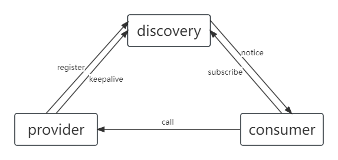
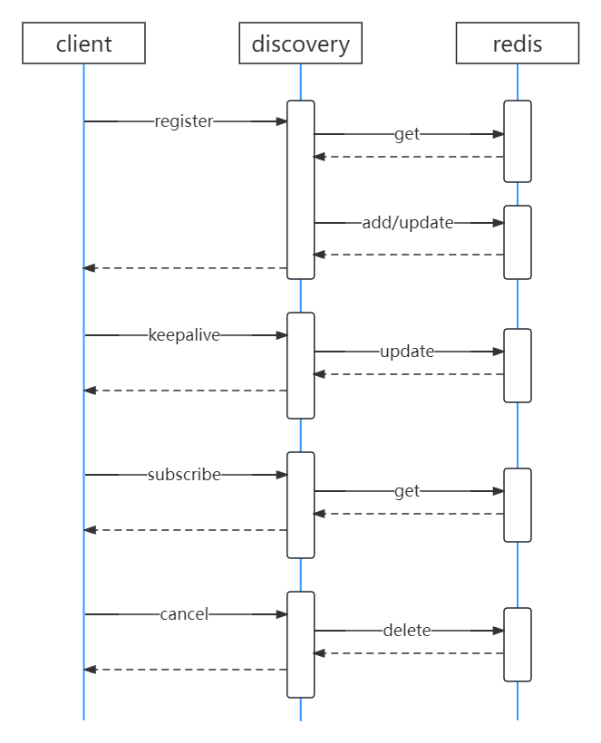

# discovery

 

## uuid+服务名+IP+端口+mac地址    作为实例唯一标识

### 注册
1. 生产者实例注册请求到discovery
2. discovery校验服务实例是否存在，存在作为一个keepalvie请求，不存在redis中新增。
3. 注册成功后下发一个token给生产者，每次keepalive时传回来作为标识。
4. discovery起定时任务，每隔30s给所有服务实例status加1，当status大于3时剔除实例。每次keepalive将status置为0.
### 订阅
1. 消费者向discovery订阅指定服务或全部服务。
2. discovery返回订阅服务的所有实例
3. 消费者订阅结果缓存本地，每隔60s刷一次
### 变更
1. 服务实例上下线时，discovery通知该服务的订阅者服务上下线情况，消费者刷本地缓存（只包含上下线的实例信息）
2. 通知失败起定时任务重试，失败3次后放弃
3. 通知任务由服务实例注册的discovery实例来做

 